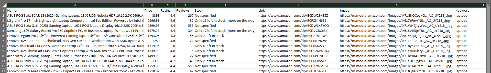

# Amazon Product Scraper (Selenium + BeautifulSoup)

## 📌 Overview
This project is a web scraper built using Selenium and BeautifulSoup to extract product data from Amazon search results.

It collects:
- Product Name
- Price
- Rating
- Number of Reviews
- Stock Status
- Product Link
- Image URL

## ⚠️ Why Selenium?
Amazon blocks traditional scraping using requests.

Selenium is used to simulate real user behavior and bypass basic anti-bot protections.

## 🚀 Features
- Dynamic keyword input
- Pagination support
- Cleaned dataset
- Export to CSV & Excel
- Error handling for stability

## 🛠️ Technologies
- Python
- Selenium
- BeautifulSoup
- Pandas

## ▶️ How to Run

```bash
pip install -r requirements.txt
python scraper.py

## ⚙️ Configuration
You can change the keyword and number of pages inside the script:
Example:
data = data_frame(keyword="laptops", max_pages=5)

Or simply run and input:
Enter product name: laptops
Enter number of pages: 3

## 📊 Output
- amazon_products.csv
- amazon_products.xlsx

## 📸 Sample Output


## 📌 Notes
This scraper is for educational purposes.
Amazon structure may change at any time.

## 👨‍💻 Author
Moumen
Aspiring Python Freelancer